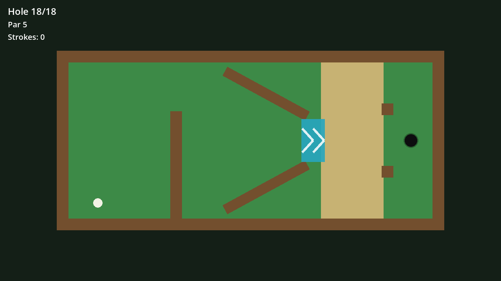
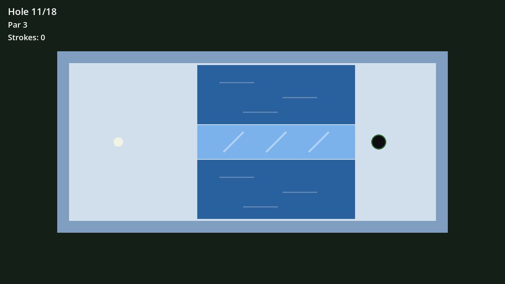
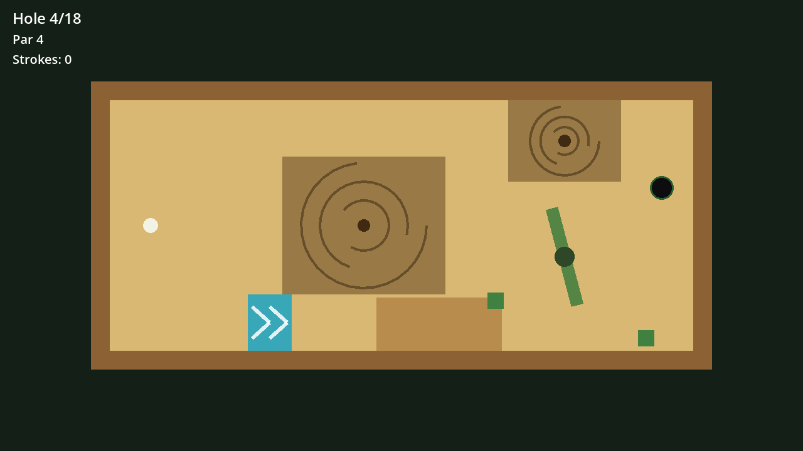
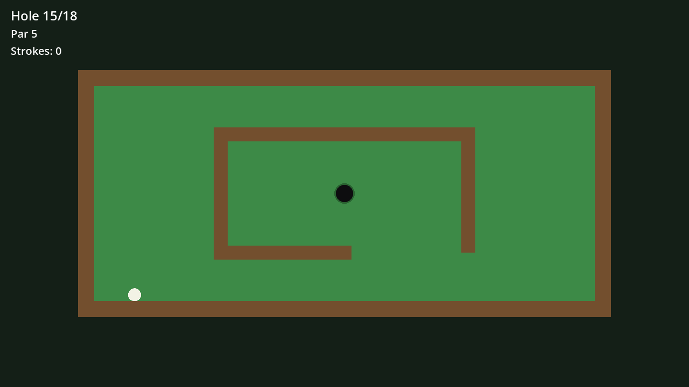
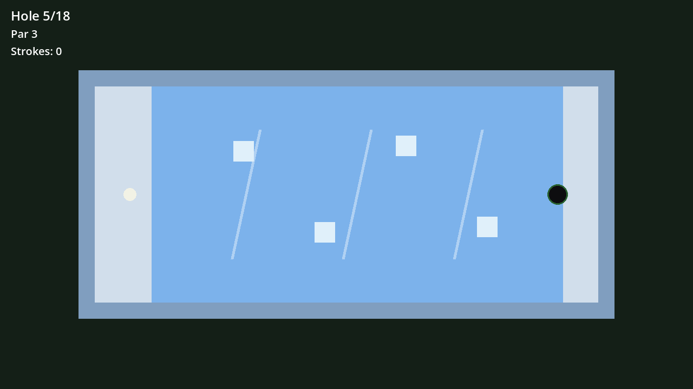
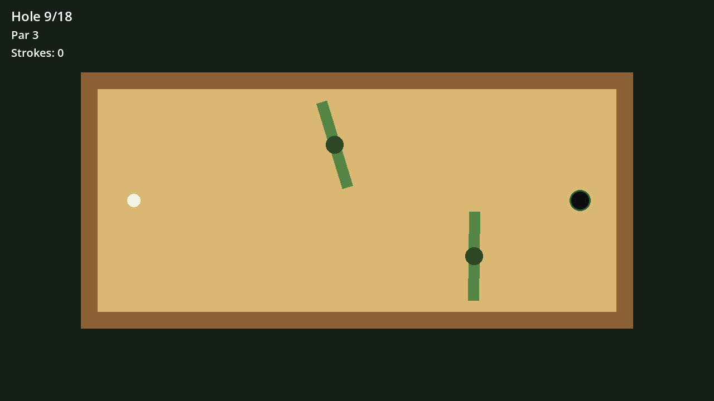

<div align="center">

# ⛳ plink

**A tiny top-down minigolf game.** Drag, release, *plink*.

Built with [Godot 4.7](https://godotengine.org/) and a Rust [GDExtension](https://github.com/godot-rust/gdext) —
all of the physics, courses, and game logic live in ~1,500 lines of Rust.

**54 holes across three courses: Classic, Ice, and Desert.**

</div>

---

## 📸 The courses

| 🌱 Classic | 🧊 Ice | 🌵 Desert |
|:---:|:---:|:---:|
|  |  |  |
|  |  |  |

- **Classic** — walls, doglegs, sand traps, and speed pads. Minigolf comfort food.
- **Ice** — near-frictionless sheets, snow that kills your roll, and water you'd rather not visit.
- **Desert** — quicksand pools that swallow slow balls, sweeping windmill spinners, dunes, and cacti.

## ⬇️ Download

Grab the latest build for your platform — every push to `main` publishes a fresh
[**`latest` release**](https://github.com/fisherrjd/plink/releases/tag/latest):

| Platform | Download |
|---|---|
| 🍎 macOS (universal) | [plink-macos.zip](https://github.com/fisherrjd/plink/releases/download/latest/plink-macos.zip) |
| 🪟 Windows (x64) | [plink-windows.zip](https://github.com/fisherrjd/plink/releases/download/latest/plink-windows.zip) |
| 🐧 Linux (x64) | [plink-linux.zip](https://github.com/fisherrjd/plink/releases/download/latest/plink-linux.zip) |

> **macOS:** the app isn't notarized, so Gatekeeper blocks the first launch. Either run
> `xattr -dr com.apple.quarantine plink.app` after unzipping, or open it once, then approve it
> under *System Settings → Privacy & Security → Open Anyway*.
>
> **Windows / Linux:** keep the extracted files together — the executable needs the
> `plink.dll` / `libplink.so` sitting next to it.

## 🎮 How to play

- **Putt** — left-click the ball, drag away from your target (slingshot style), release. Longer drag = more power.
- **Chip** — same, but with the **right** mouse button (the aim line turns orange). The ball flies over walls, sand, and hazards… and lands hot.
- Sink all 18, beat par, admire the scorecard. Each course grid on the menu also lets you jump straight to any hole for practice.

A few things the courses will throw at you:

| | |
|---|---|
| 🟦 **Speed pads** | boost the ball hard in the arrow's direction |
| 🌀 **Spinners** | rotating bars that will happily bat your ball somewhere worse |
| 🏖️ **Sand & snow** | heavy drag — sometimes a brake, sometimes a wall |
| 🕳️ **Quicksand** | roll in too slow and the ball gets *swallowed* (stroke + reset) |
| 💧 **Water** | it's water. Don't. |

## 🤖 Playtested by an AI caddy

Every course has been played start-to-finish — under par — by Claude driving the game
through a small IPC bridge (`tools/caddy.py`), one aimed stroke at a time. The
hole-by-hole write-ups, screenshots, and scorecards live in each course directory:

- [Classic — 38 (−24)](course1/REPORT.md)
- [Ice — 32 (−30)](ice/REPORT.md)
- [Desert — 47 (−16)](desert/REPORT.md)

## 🔧 Building from source

You'll need Rust and Godot 4.7.

```sh
# 1. Build the GDExtension
cd rust && cargo build --release

# 2. Run the game
godot --path godot
```

The repo layout:

```
godot/   Godot project (scenes, export presets) — logic lives in the extension
rust/    the entire game as a Rust GDExtension (ball physics, courses, menu, caddy bridge)
tools/   caddy.py — CLI bridge for driving the game programmatically
```

Releases are exported per-platform by [CI](.github/workflows/build.yml) using the
`linux` / `windows` / `macos` presets in `godot/export_presets.cfg`.

---

<div align="center">

*plink* 🏌️

</div>
